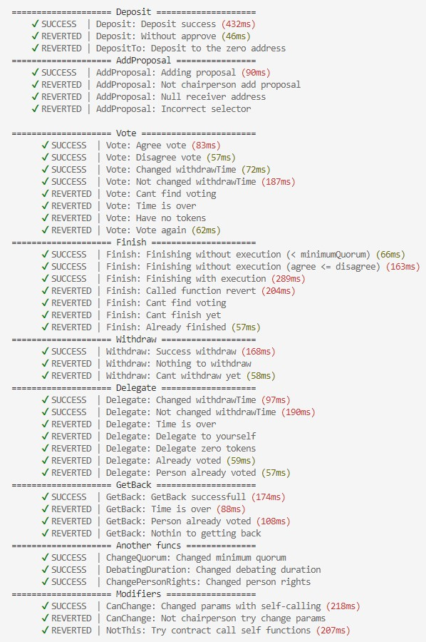
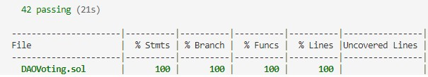

  
  

Написан, развернут и верифицирован DAO контракт по адресу [0xC2a715208b3dAbe806080D8B58359481A079560F](https://rinkeby.etherscan.io/address/0xC2a715208b3dAbe806080D8B58359481A079560F).  

Для участия в голосованиях используется токен DAOT, задеплоенный по адресу [0x7D5A9D14FEC53f22b6045Dab879B225E42f98991](https://rinkeby.etherscan.io/token/0x7D5A9D14FEC53f22b6045Dab879B225E42f98991).  

Реализована возможность делегации токенов с помощью функций delegate() и getBack().  
Кроме того, реализована возможность голосования за вызов некоторых собственных функций. Например, для изменения прав пользователей или продолжительности голосований.  
Также добавлен модификатор, который не позволяет вызывать остальные функции написанного смарт-контракта от лица самого себя.  

Написаны hardhat task`и для взаимодействия с контрактом.
